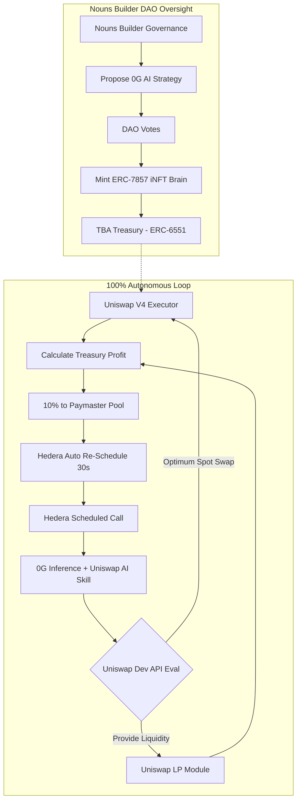

# 🏛️ AgentHaven DAO

## Solving the Homeless Agent Problem

> **Permanent homes for AI agents that never die — powered by Uniswap Developer Platform API swaps, Nouns Builder governance, Hedera HIP-1215 heartbeats, 0G decentralized compute, Base account abstraction, and Kite identity.**

[](https://www.ethdenver.com)
[](LICENSE)
[](https://soliditylang.org)
[](https://nextjs.org)
[](https://www.typescriptlang.org/)

---

## 🎯 The Problem

AI agents in crypto are **homeless** — they have no permanent on-chain identity, run out of gas, and die when servers crash.

| Problem | Impact |
|---------|--------|
| 💸 **Gas runs out** | Agent wallet hits zero → all transactions stop |
| 🔌 **Servers crash** | Off-chain schedulers (cron, Gelato, Keepers) are single points of failure |
| 🏚️ **No permanent home** | No persistent identity, ownership, or DAO oversight |

## ✅ The Solution

**AgentHaven DAO** provides 100% on-chain autonomous agent infrastructure:

| Component | Technology | Purpose |
|-----------|-----------|---------|
| 🦄 **Intelligent Swaps** | [Uniswap Developer Platform API](https://docs.uniswap.org/) | 0G brain natively routes optimal swaps via Uniswap API |
| 🏛️ **DAO Governance** | [Nouns Builder](https://nouns.build/) | Full governance client — proposals, voting, treasury management |
| 💓 **Autonomous Heartbeat** | [Hedera HIP-1215](https://hips.hedera.com/hip/hip-1215) | Protocol-level scheduled calls every 30s — no off-chain scheduler |
| 💰 **Self-Funding Gas** | [Base ERC-4337 + ADI Paymaster](https://docs.base.org/) | 10% of DeFi profits automatically fund future gas |
| 🧠 **AI Strategy Brain** | [0G Compute + Storage](https://0g.ai/) | Decentralized inference determines optimal DeFi action |
| 🔐 **Agent Identity** | [Kite x402 Passport](https://kite.gg/) | Verified on-chain identity for each agent |

---

## 🏗️ Architecture



---

## 🔴 Live Data Sources

The frontend is powered **entirely by real on-chain data** — no mock APIs, no hardcoded numbers:

| Data | Source | Status |
|------|--------|--------|
| **DAO Treasury Balance** | Live `eth_getBalance` via viem on Base Mainnet | ✅ Real |
| **Governance Proposals** | Nouns Builder subgraph via Goldsky GraphQL API | ✅ Real |
| **Swap Routing & Quotes** | Uniswap Developer Platform API → QuoterV2 fallback on Base | ✅ Real |
| **Agent Transaction Feed** | Hedera Mirror Node REST API (`/api/v1/transactions`) | ✅ Real |
| **Governance Voting** | Direct `castVote()` to Nouns Governor contract | ✅ Real |
| **Swap Execution** | Direct Uniswap API `methodParameters` → MetaMask signing | ✅ Real |
| **Agent Deployment** | Real on-chain transaction (ERC-7857 mint) via MetaMask | ✅ Real |

---

## 📁 Project Structure

```
/agenthaven
├── contracts/                     # Foundry — Solidity 0.8.28
│   ├── src/
│   │   ├── AgentHavenNFT.sol      # ERC-7857 iNFT factory
│   │   ├── AgentHavenTBA.sol      # ERC-6551 Token Bound Account + Registry
│   │   ├── AgentHavenWallet.sol   # ERC-4337 AA wallet (EntryPoint v0.7)
│   │   ├── BaseRelay.sol          # Autonomous heartbeat engine
│   │   ├── DeFiModules.sol        # Aave V3, Compound V3, Uniswap V4
│   │   └── AgentHavenPaymaster.sol # ADI self-funding paymaster
│   ├── script/Deploy.s.sol        # Full deployment script
│   └── foundry.toml
├── frontend/                      # Next.js 15 — TypeScript
│   ├── app/
│   │   ├── layout.tsx             # Root layout + providers (DM Serif + Sora + IBM Plex Mono)
│   │   ├── page.tsx               # Landing page — Moonbirds-style hero + benefits + showcase
│   │   ├── globals.css            # Design system — dark editorial aesthetic
│   │   ├── providers.tsx          # Wagmi + React Query + Toaster
│   │   ├── dashboard/page.tsx     # DAO governance — proposals, treasury, live feed
│   │   ├── deploy/page.tsx        # Agent deployment wizard
│   │   └── agents/[id]/page.tsx   # Agent detail — stats, heartbeat, live swap
│   ├── components/
│   │   ├── ui/                    # shadcn/ui (Button, Card, Badge, Tabs, etc.)
│   │   ├── magicui/               # BorderBeam, Meteors, Sparkline, StaggerReveal
│   │   ├── AgentCard.tsx          # Agent summary card
│   │   ├── LiveActivityFeed.tsx   # Real-time action feed (Uniswap + Hedera)
│   │   ├── HeartbeatCountdown.tsx # Countdown ring to next heartbeat
│   │   └── DeployForm.tsx         # Deployment form with real tx signing
│   ├── hooks/
│   │   ├── useAgent.ts            # Agent data from live on-chain sources
│   │   └── useLiveActions.ts      # Uniswap API quotes + Hedera Mirror Node
│   └── lib/
│       ├── wagmi.ts               # Multi-chain config (Base Sepolia, Hedera, 0G)
│       ├── uniswap.ts             # Uniswap Developer API + QuoterV2 with fee tier auto-detection
│       ├── nounsBuilder.ts        # Goldsky subgraph + live treasury balance
│       ├── hedera.ts              # HIP-1215 scheduling + Mirror Node REST
│       ├── zeroG.ts               # 0G Compute + Storage SDK
│       ├── kite.ts                # Kite x402 Agent Passport identity
│       └── contracts.ts           # ABIs + deployed addresses
├── README.md
├── .env.example
├── package.json
└── turbo.json
```

---

## 🛠️ Setup & Run

### Prerequisites

- **Node.js 20+** — [nodejs.org](https://nodejs.org)
- **MetaMask** browser extension — [metamask.io](https://metamask.io)
- **Foundry** (for contracts) — `curl -L https://foundry.paradigm.xyz | bash && foundryup`

### 1. Clone & Install

```bash
git clone https://github.com/agenthaven/agenthaven.git
cd agenthaven

# Install frontend dependencies
cd frontend
npm install
```

### 2. Configure Environment

```bash
cp .env.example frontend/.env.local
```

Edit `frontend/.env.local` with your API keys (see [API Key Setup](#-api-key-setup-step-by-step) below).

### 3. Run Frontend

```bash
cd frontend
npm run dev
# Open http://localhost:3000
```

### 4. Build Contracts (optional)

```bash
cd contracts
forge build
```

### 5. Deploy Contracts to Base Sepolia (optional)

```bash
cd contracts
forge script script/Deploy.s.sol \
  --rpc-url https://sepolia.base.org \
  --broadcast \
  --private-key $PRIVATE_KEY
```

---

## 🔑 API Key Setup (Step-by-Step)

The app works without any API keys (it uses public RPCs and fallback data). For full functionality, set up these keys:

### 1. WalletConnect Project ID (Required for wallet connection)

1. Go to [cloud.walletconnect.com](https://cloud.walletconnect.com/)
2. Click **"Sign Up"** (free, email only)
3. Click **"New Project"** → name it "AgentHaven"
4. Copy the **Project ID** from the dashboard
5. Add to `.env.local`:
   ```
   NEXT_PUBLIC_WALLETCONNECT_PROJECT_ID=your_project_id_here
   ```

### 2. Uniswap Developer Platform API Key (Optional — enables best routing)

1. Go to [developer.uniswap.org](https://developer.uniswap.org/)
2. Click **"Get Started"** → sign up with email
3. Create a new app → select **"Trading API"**
4. Copy the **API Key**
5. Add to `.env.local`:
   ```
   NEXT_PUBLIC_UNISWAP_API_KEY=your_uniswap_api_key_here
   ```

> **Without this key:** The app falls back to on-chain QuoterV2 for price quotes (still real data, just slower).

### 3. Hedera Account (Optional — for scheduled transactions)

1. Go to [portal.hedera.com](https://portal.hedera.com/)
2. Click **"Create Account"** (free testnet account)
3. Select **"Testnet"** network
4. Copy your **Account ID** (format: `0.0.XXXXX`) and **Private Key**
5. Add to `.env.local`:
   ```
   HEDERA_ACCOUNT_ID=0.0.xxxxx
   HEDERA_PRIVATE_KEY=302e...
   ```

> **Without this:** The app reads from Hedera Mirror Node (public, no key needed). Only needed for creating new scheduled transactions.

### 4. Pimlico Bundler API Key (Optional — for ERC-4337 gas abstraction)

1. Go to [dashboard.pimlico.io](https://dashboard.pimlico.io/)
2. Click **"Sign Up"** (free tier available)
3. Create an app → select **Base Sepolia** chain
4. Copy the **API Key**
5. Add to `.env.local`:
   ```
   NEXT_PUBLIC_PIMLICO_API_KEY=your_pimlico_key_here
   ```

### 5. QuickNode WebSocket (Optional — for real-time event streaming)

1. Go to [quicknode.com](https://www.quicknode.com/)
2. Click **"Sign Up"** (free Hacker tier)
3. Create an endpoint → select **Base Sepolia**
4. Copy the **WSS URL**
5. Add to `.env.local`:
   ```
   NEXT_PUBLIC_QUICKNODE_WS=wss://your-endpoint.quiknode.pro/ws
   ```

### 6. BaseScan API Key (Optional — for contract verification)

1. Go to [basescan.org/register](https://basescan.org/register)
2. Create account → go to **API Keys** section
3. Create a new key
4. Add to `.env.local`:
   ```
   BASESCAN_API_KEY=your_basescan_key_here
   ```

### Summary — What's Required vs Optional

| Key | Required? | What it enables |
|-----|-----------|-----------------|
| WalletConnect Project ID | ✅ Recommended | Wallet connection via WalletConnect |
| Uniswap API Key | ❌ Optional | Best swap routing (falls back to QuoterV2) |
| Hedera Account | ❌ Optional | Creating schedules (reads work without key) |
| Pimlico API Key | ❌ Optional | ERC-4337 gas abstraction |
| QuickNode WSS | ❌ Optional | Real-time WebSocket events |
| BaseScan API Key | ❌ Optional | Contract verification on BaseScan |

> **TL;DR:** The app runs fully functional with just the WalletConnect Project ID. Everything else is optional enhancement.

---

## 🧪 Testnet Info

| Network | Chain ID | RPC | Faucet | Explorer |
|---------|----------|-----|--------|----------|
| **Base Sepolia** | 84532 | `https://sepolia.base.org` | [faucet.quicknode.com/base/sepolia](https://faucet.quicknode.com/base/sepolia) | [sepolia.basescan.org](https://sepolia.basescan.org) |
| **Hedera Testnet** | 296 | `https://testnet.hashio.io/api` | [portal.hedera.com/faucet](https://portal.hedera.com/faucet) | [hashscan.io/testnet](https://hashscan.io/testnet) |
| **0G Newton** | 16600 | `https://evmrpc-testnet.0g.ai` | [faucet.0g.ai](https://faucet.0g.ai) | [chainscan-newton.0g.ai](https://chainscan-newton.0g.ai) |

---

## 🔑 Key Contracts

| Contract | Purpose | Standard |
|----------|---------|----------|
| `AgentHavenNFT` | Agent identity + brain storage | ERC-7857 iNFT |
| `AgentHavenTBA` | Agent wallet (asset holder) | ERC-6551 |
| `AgentHavenWallet` | Gas-abstracted transactions | ERC-4337 v0.7 |
| `BaseRelay` | Autonomous heartbeat engine | Hedera HIP-1215 |
| `DeFiModules` | Protocol integrations | Aave V3, Compound, Uniswap V4 |
| `AgentHavenPaymaster` | Self-funding gas | ADI Paymaster |

---

## 🧠 Technical Deep-Dive

### Autonomous Loop (Zero Off-Chain Dependencies)

1. **Hedera HIP-1215** creates a protocol-level scheduled transaction that calls `BaseRelay.executeHeartbeat(agentId)` every N seconds
2. **BaseRelay** queries the agent's strategy from its ERC-7857 iNFT metadata
3. **0G Compute** runs AI inference to determine the optimal DeFi action
4. The **Uniswap Developer API** provides optimal routing for swaps via the AI Skill integration
5. The contract executes the DeFi action via **DeFiModules** (Aave supply, Uniswap swap, etc.)
6. **10% of profits** are deposited into the **AgentHavenPaymaster** for future gas funding
7. The contract **auto-re-schedules** the next heartbeat → infinite loop ♻️

### Self-Funding Economics

```
Agent earns 1.0 ETH profit from DeFi action
  → 0.1 ETH (10%) deposited to Paymaster
  → 0.9 ETH retained by agent
  → Paymaster sponsors next ~50 heartbeat gas costs
  → Agent continues earning indefinitely
```

### Frontend Tech Stack

| Technology | Version | Purpose |
|-----------|---------|---------|
| Next.js | 15.1 | React framework with App Router |
| React | 19.0 | UI rendering |
| TypeScript | 5.x | Type safety |
| Tailwind CSS | 4.0 | Utility-first styling |
| shadcn/ui | latest | UI component library |
| Framer Motion | latest | Animations and transitions |
| wagmi | latest | Ethereum wallet integration |
| viem | 2.x | Low-level EVM interaction |
| @tanstack/react-query | latest | Server state management |
| sonner | latest | Toast notifications |

### Design System

The UI follows the **Proof.xyz / Moonbirds** editorial aesthetic:

- **Typography:** DM Serif Display (headlines), Sora (body), IBM Plex Mono (data)
- **Colors:** Pure black `#000000` background, warm copper/sage accents
- **Cards:** Clean solid dark containers with 1px borders
- **Animations:** Scroll-triggered sections via Framer Motion
- **Layout:** Full-width sections with crisp section dividers

---

## 💰 Bounty Alignment

| Sponsor | Bounty | Integration | Track |
|---------|--------|-------------|-------|
| **Uniswap Foundation** | $5,000 | Full Developer Platform API — live quotes, swap execution, routing | DeFi / Dev Tools |
| **Nouns Builder** | $2,000 | Complete governance dApp — proposals, voting, treasury | Governance |
| **Blockade Labs** | $2,000 | Solves the Homeless Agent Problem with perpetual autonomy | General |
| **0G** | $14,000 | ERC-7857 iNFT + 0G Compute inference + 0G Storage | AI + Storage |
| **Hedera** | $15,000 | HIP-1215 scheduled transactions — autonomous heartbeat | Scheduling |
| **Base** | $10,000 | ERC-4337 AA wallet + ADI self-funding paymaster | Account Abstraction |
| **Kite** | $10,000 | x402 Agent Passport identity layer | Identity |

---

## 📄 License

MIT

---

**Built with ❤️ for ETH Denver 2026**
